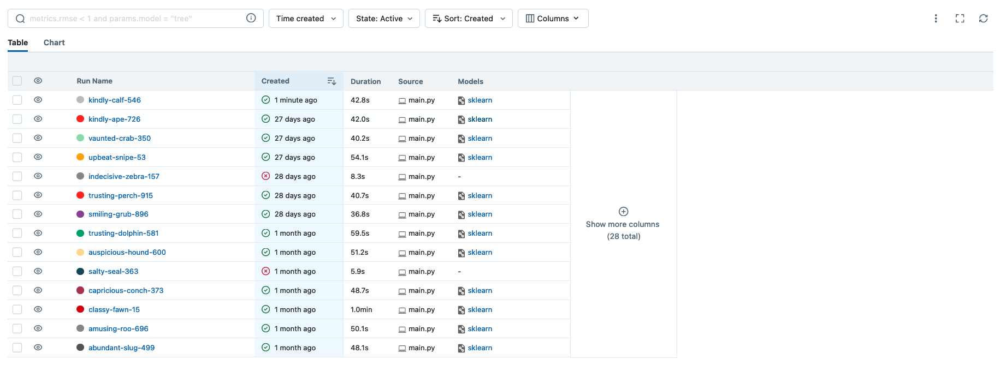
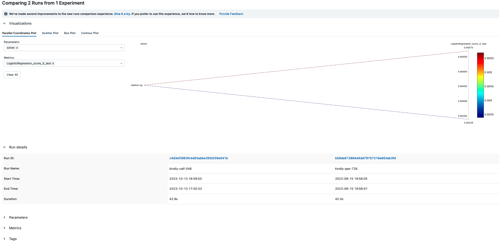

# Chrold

Run your ML commit directly on production

## In a Nutshell

Chrold is a free and easy-to-use [repository template](https://docs.github.com/en/repositories/creating-and-managing-repositories/creating-a-repository-from-a-template) for your Machine Learning project which lets you run your commit directly on production with zero effort.

It's an [MLOps](https://ml-ops.org/) pipeline which builds, trains, tracks your models and finally, you can deploy your desired version as a Docker container on production.

## Quick Start

* Create an account in [Databricks](https://databricks.com/try-databricks) (the community edition is free!)
    - If you want to self-host the tracking server, see the Advanced Usage section below.
* Set up these variables as your [repository secrets](https://docs.github.com/en/actions/security-guides/using-secrets-in-github-actions):
    - ```DATABRICKS_HOST=<YOUR_HOST> (for example: https://community.cloud.databricks.com)```
    - ```DATABRICKS_USERNAME=<YOUR_USERNAME>```
    - ```DATABRICKS_PASSWORD=<YOUR_PASSWORD>```
    - ```MLFLOW_TRACKING_URI=<DATABRICKS_HOST>```
    - ```MLFLOW_TRACKING_USERNAME=<DATABRICKS_USERNAME>```
    - ```MLFLOW_TRACKING_PASSWORD=<DATABRICKS_PASSWORD>```
* Set up ```EXPERIMENT``` with your desired experiment name and [```TRACKING_UI```](https://mlflow.org/docs/latest/tracking.html#where-runs-are-recorded) variables in ```main.py```.
* Implement the ```train``` function in ```src/train.py``` and done!

## Architecture


In a traditional software, usually, change has a single source, the Source Code!

In an ML-based software we have three sources for changes:
- Source Code (Learning Algorithm)
- Model parameters (Hyperparameters)
- Data

By abstracting the Data layer in a single storage, this pipeline provides the needed infrastructure for building, training/testing, tracking and deploying these changes using [MLflow](https://mlflow.org/), the heart of this project.

Let's explore each part in detail...

### Build
On each push, the pipeline will be triggered and builds a Docker image from your source code (aka Dockerizes it), then pushes that into the [container registry](https://docs.github.com/en/packages/working-with-a-github-packages-registry/working-with-the-container-registry); the train image!

By running this image, the training process will be started, wherever you want!
### Train/Test
If you create a tag for a commit, the pipeline, after the building stage automatically starts the training process...

[Runner](https://docs.github.com/en/actions/using-github-hosted-runners/about-github-hosted-runners) fetches the data from your Data source and trains the model. In this way, we address the changes introduced by Hyperparameters, Learning Algorithm and Data source (tag an existing commit).
### Track
During the training phase, runner communicates with your [tracking server](https://mlflow.org/docs/latest/tracking.html) (like Databricks) and at the end, you have the metadata for each run. (model version, input parameters, final metrics)





### Deploy
After the traning has finished, the pipeline builds a [Docker image](https://mlflow.org/docs/latest/models.html#local-model-deployment) from your trianed model and pushes that to the registry as the deploy image. 

By running this image you can start inferencing via API calls.

## Advanced Usage
This pipeline is designed for scalability, you can use it just for rapid experimentations or for complex use cases in production scale!

Let's see how you can enhance each part independently...

### Train/Test
* If your changes is just related to the Data layer, tagging can be tedious for training. In this case, you can use the ```ct.sh``` script. This script triggers your pipeline and starts the trainig phase using the ```latest``` train image. Essentially, it's a Github [feature](https://docs.github.com/en/rest/actions/workflows?apiVersion=2022-11-28#create-a-workflow-dispatch-event) which allows you to trigger your pipeline based on an event outside of Github. So you can set it up as a cronjob to continuously trains your model or bind it to the events related to the changes in Data, so your model will stay updated.
* By default, the training phase starts training a model from scratch. The ```train``` function accepts two args, ```warm_start``` and ```warm_start_run_id```. By passing ```True``` to ```warm_start``` and the run id of the model you want to retrain (fine tune) to ```warm_start_run_id```, your training phase starts by loading an existing model and retraining that. Also, this way works for evaluating your model correctness by not training but testing the model on a newly arrived Dataset.
* Your model needs an specific hardware/software configs? [self-host](https://docs.github.com/en/actions/hosting-your-own-runners) your own runner and manage the training environment!

### Track
* MLflow has an [autologging feature](https://mlflow.org/docs/latest/tracking.html#automatic-logging) and this repo uses that by default. If autologging doesn't support your model, you should consider [manual logging](https://mlflow.org/docs/latest/tracking.html#logging-functions).
* The Quick Start section offers using the Databricks tracking servers and avoid unnecessary complexities. But if you want full control on your pipeline, you can [self-host](https://mlflow.org/docs/latest/tracking.html#scenario-4-mlflow-with-remote-tracking-server-backend-and-artifact-stores) your own tracking servers!

### Deploy 
* Considering the fact that deploying environments are in various forms, the default behaviour of this pipeline is creating a Docker image which is a ready-to-use http server serving your trained model. Furthermore, you have [access](https://mlflow.org/docs/latest/cli.html#mlflow-artifacts) to the [model artifacts](https://mlflow.org/docs/latest/tracking.html#concepts) which allows you creating your own deployment structure.
