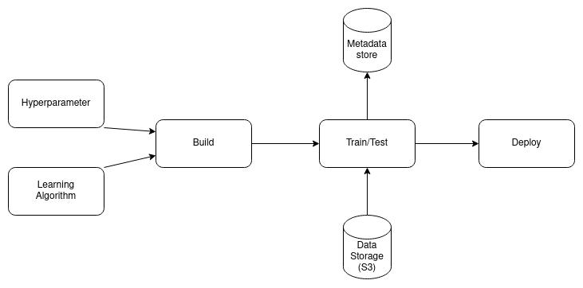

# Chrold

Run your ML commit directly on production

## In a Nutshell

Chrold is a free and easy-to-use repository template for your Machine Learning project which lets you run your commit directly on production with zero effort.

It's an MLOps pipeline which build, train, track your models and finally, you can deploy your desired version as a Docker container on production.

## Quick Start

* Create an account in [Databricks](https://databricks.com/try-databricks) (the community edition is free!)
    - If you want to self-host the tracking server, see the Advanced Usage section below.
* Set up these variables as your [repository secrets](https://docs.github.com/en/actions/security-guides/using-secrets-in-github-actions):
    - ```DATABRICKS_HOST=<YOUR_HOST> (for example: https://community.cloud.databricks.com)```
    - ```DATABRICKS_USERNAME=<YOUR_USERNAME>```
    - ```DATABRICKS_PASSWORD=<YOUR_PASSWORD>```
    - ```MLFLOW_TRACKING_URI=<DATABRICKS_HOST>```
    - ```MLFLOW_TRACKING_USERNAME=<DATABRICKS_USERNAME>```
    - ```MLFLOW_TRACKING_PASSWORD=<DATABRICKS_PASSWORD>```
* Set up ```EXPERIMENT``` with your desired experient name and [```TRACKING_UI```](https://mlflow.org/docs/latest/tracking.html#where-runs-are-recorded) variables in ```main.py```.
* Implement the ```train``` function in ```src/train.py``` and done!

## Architecture



In a traditional software, usually, change has a single source, the Source Code!

In an ML-based software we have three sources for changes:
- Source Code (Learning Algorithm)
- Model parameters (Hyperparameters)
- Data

By abstracting the Data layer in a single storage, this pipeline provides the needed infrastructure for building, training/testing, tracking and deploying these changes using [MLflow](https://mlflow.org/), the heart of this project.

Let's explore each part in detail...

### Build
On each push, the pipeline will be triggered and builds a Docker image from your source code (aka Dockerizes it), then pushes that into the [container registry](https://docs.github.com/en/packages/working-with-a-github-packages-registry/working-with-the-container-registry); the train image!

By running this image, the training process will be started, wherever you want!
### Train/Test
If you create a tag for a commit, the pipeline, after the building stage automatically starts the training process...

[Runner](https://docs.github.com/en/actions/using-github-hosted-runners/about-github-hosted-runners) fetches the data from your Data source and trains the model. In this way, we address the changes introduced by Hyperparameters, Learning Algorithm and Data source (tag an existing commit).
### Track
During the training phase, runner communicates with your [tracking server](https://mlflow.org/docs/latest/tracking.html) (like Databricks) and at the end, you have the metadata for each run. (model version, input parameters, final metrics)
### Deploy
After the traning has finished, the pipeline builds a Docker image from your trianed model and pushes that to the registry as the deploy image. 

By running this image you can start inferencing via API calls.

## Advanced Usage

### Train/Test
warm start
test and validation
self host runner
ct script
### Track
self host the server
manual tracking, not autologging
### Deploy 
build your own bin
